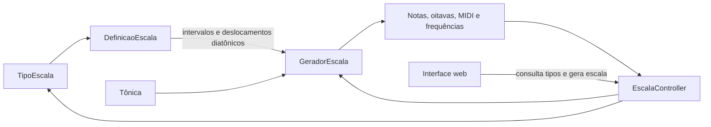

# Gerador de Escalas Musicais

Aplicação web em Java para gerar, visualizar e ouvir escalas musicais com diferentes quantidades de notas e grafia correta de sustenidos e bemóis.

## Funcionalidades

- geração de escalas maiores e menores;
- suporte a escalas pentatônicas e de tons inteiros;
- suporte aos sete modos diatônicos e às escalas octatônicas dom-dim e dim-dom;
- escalas blues, dominantes modernas, bebop dominante, cromática e aumentada;
- catálogo declarativo, extensível sem criar um novo algoritmo para cada escala;
- suporte às 21 grafias de tônica natural, sustenida ou bemolizada, de `C` a `B`;
- uso automático de sustenidos, bemóis, sustenidos duplos e bemóis duplos quando necessários;
- cálculo da oitava pelo intervalo absoluto, do número MIDI e da frequência;
- reprodução sequencial no navegador pela Web Audio API;
- timbres sintetizados de piano e violino, controle de volume e interrupção;
- API HTTP com descoberta dos tipos de escala disponíveis;
- interface responsiva, sem framework JavaScript e sem banco de dados.

Tipos disponíveis:

| Identificador | Nome |
|---|---|
| `maior` | Maior |
| `menor-natural` | Menor natural |
| `menor-melodica` | Menor melódica ascendente |
| `menor-harmonica` | Menor harmônica |
| `modal-jonio` | Modal - Jônio |
| `modal-dorico` | Modal - Dórico |
| `modal-frigio` | Modal - Frígio |
| `modal-lidio` | Modal - Lídio |
| `modal-mixolidio` | Modal - Mixolídio |
| `modal-eolio` | Modal - Eólio |
| `modal-locrio` | Modal - Lócrio |
| `dom-dim` | Dom dim (semitom-tom) |
| `dim-dom` | Dim dom (tom-semitom) |
| `blues-menor` | Blues menor |
| `blues-maior` | Blues maior |
| `frigio-dominante` | Frígio dominante |
| `lidio-dominante` | Lídio dominante |
| `alterada` | Alterada (superlócria) |
| `bebop-dominante` | Bebop dominante |
| `cromatica` | Cromática |
| `aumentada` | Aumentada |
| `pentatonica-maior` | Pentatônica maior |
| `pentatonica-menor` | Pentatônica menor |
| `tons-inteiros` | Tons inteiros |

Exemplos:

```text
F maior              -> F - G - A - Bb - C - D - E - F
G# maior             -> G# - A# - B# - C# - D# - E# - F## - G#
A menor harmônica   -> A - B - C - D - E - F - G# - A
C pentatônica maior -> C - D - E - G - A - C
C tons inteiros      -> C - D - E - F# - G# - A# - C
```

## Tecnologias

- Java 25;
- Spring Boot 4.1;
- Spring Web MVC;
- Maven Wrapper;
- HTML, CSS e JavaScript;
- Web Audio API;
- JUnit 5.

## Como executar

Pré-requisito: JDK 25 instalado e disponível no `PATH`.

No Windows, abra o PowerShell na raiz do projeto:

```powershell
.\mvnw.cmd spring-boot:run
```

No Linux ou macOS:

```bash
./mvnw spring-boot:run
```

Se o Maven estiver instalado no sistema, também é possível usar:

```bash
mvn spring-boot:run
```

Depois, acesse [http://localhost:8080](http://localhost:8080). Para encerrar, pressione `Ctrl+C` no terminal.

## Como usar

1. Selecione a tônica.
2. Escolha um dos tipos de escala carregados pela API.
3. Clique em **Gerar escala**.
4. Escolha o timbre, ajuste o volume e clique em **Ouvir escala**.
5. Use **Parar** para interromper a reprodução.

O som é sintetizado pelo navegador e depende do suporte à Web Audio API.

## API HTTP

### Consultar os tipos disponíveis

```http
GET /api/escalas/tipos
```

Exemplo de resposta:

```json
[
  { "id": "maior", "nome": "Maior" },
  { "id": "pentatonica-maior", "nome": "Pentatônica maior" }
]
```

### Gerar uma escala

```http
GET /api/escalas/{tipo}?tonica={tonica}
```

Exemplos:

```http
GET /api/escalas/maior?tonica=F%23
GET /api/escalas/menor-harmonica?tonica=A
GET /api/escalas/pentatonica-maior?tonica=C
GET /api/escalas/tons-inteiros?tonica=C
```

A tônica pode ser natural (`C`), sustenida (`C#` ou `C♯`) ou bemolizada (`Cb` ou `C♭`). Em URLs, `#` deve ser codificado como `%23`.

Tipos desconhecidos retornam `404 Not Found`; tônicas inválidas retornam `400 Bad Request`.

Exemplo de resposta:

```json
{
  "tonica": "C",
  "notas": [
    {
      "nome": "C",
      "oitava": 4,
      "midi": 60,
      "frequencia": 261.6255653005986
    },
    {
      "nome": "D",
      "oitava": 4,
      "midi": 62,
      "frequencia": 293.6647679174076
    }
  ]
}
```

Cada nota contém sua grafia musical, oitava científica, número MIDI e frequência em hertz, calculada com `A4 = 440 Hz`.

## Arquitetura

O domínio separa a fórmula da escala do algoritmo que gera as notas:



- `DefinicaoEscala` descreve o identificador, o nome, os intervalos cromáticos e os deslocamentos das letras.
- `TipoEscala` funciona como catálogo das definições disponíveis.
- `GeradorEscala` aplica qualquer definição a uma tônica, sem pressupor sete notas.
- `EscalaController` resolve o identificador recebido, executa o gerador e expõe o resultado como JSON.
- A interface consulta `/api/escalas/tipos`, evitando duplicar no HTML a lista mantida pelo backend.

Os intervalos determinam a altura e a oitava reais. Os deslocamentos diatônicos determinam a letra usada na grafia. Essa separação permite, por exemplo, representar `C - D - E - G - A` na pentatônica maior sem produzir grafias artificiais como `F##` no lugar de `G`.

Para adicionar uma escala, inclua uma definição em `TipoEscala`:

```java
PENTATONICA_MAIOR(
    "pentatonica-maior",
    "Pentatônica maior",
    partes(0, 2, 4, 7, 9, 12)
        .comDeslocamentos(0, 1, 2, 4, 5, 7)
)
```

Os dois conjuntos precisam ter o mesmo tamanho. O primeiro intervalo deve ser zero, representando a tônica.

As antigas classes específicas, como `GeradorEscalaMaior`, permanecem como adaptadores para preservar compatibilidade, mas delegam ao gerador genérico.

## Testes

No Windows:

```powershell
.\mvnw.cmd test
```

No Linux ou macOS, use `./mvnw test`. A suíte cobre:

- escalas heptatônicas e pentatônicas;
- grafia e acidentes simples ou duplos;
- equivalência enarmônica;
- escalas que atravessam mais de uma oitava;
- cálculo de altura, MIDI, oitava e frequência;
- catálogo, validação de entradas e respostas da camada web;
- inicialização do contexto Spring Boot.

O projeto não exige banco de dados, login, serviço de áudio externo ou processo separado para o front-end.
